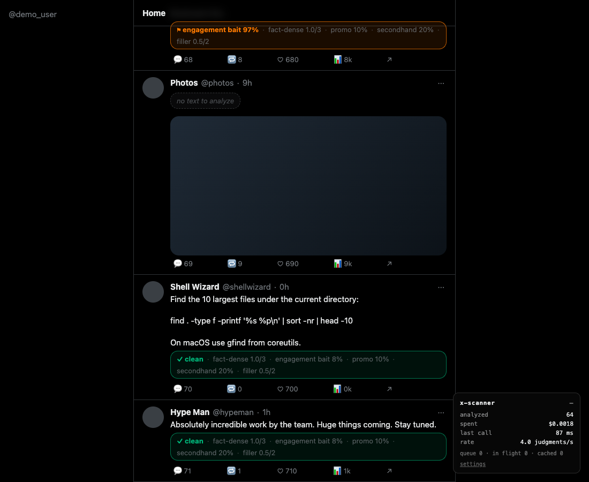

# x-scanner

Behavioral labels on every post you scroll past on X, judged by [Jev](https://docs.typesafe.ai),
TypeSafe's System One model, with a counter in the corner showing exactly what it cost.



*Captured on the test fixture, which mimics X's markup. On x.com it looks the same.*

A post that stays on screen for 200 ms is sent to Jev with five typed questions in one request. The
answer comes back in about 150 ms as numbers, not prose, and lands in a chip under the post. Most posts
come back clean. The ones that don't get an orange flag. Scroll for a minute and the panel reads
something like 80 posts, $0.0027.

## What you see

**Under each post**, a chip styled like X's own metadata line:

- `✓ clean` in green when nothing crossed a threshold, followed by all five values in gray.
- `⚑ engagement bait 97%` in orange when something did, followed by the rest in gray.
- `no text to analyze` or `promoted, not analyzed` in dashed gray for posts that are skipped.
- Click the chip for a card with a bar per dimension, the token count, cost and latency of that call.

**Bottom right**, a small panel: posts analyzed this session, dollars spent to four decimals, the last
call's latency, and judgments per second. The dollar figure is exact, not estimated: Jev returns
`usage.input_tokens` with every answer.

## The five dimensions

All five judge the text's behavior. None judge the author. Every one is editable in settings.

| label | type | question, in short | flags when |
| --- | --- | --- | --- |
| `fact-dense` | Score, 4 levels | how much specific, verifiable content the text has | ≥ 2.5 of 3 |
| `engagement bait` | Noul | does it end by asking for replies, reposts, likes, follows, or bookmarks | ≥ 75% |
| `promo` | Noul | is it pushing a product, course, newsletter, community, or paid offer | ≥ 75% |
| `secondhand` | Noul | does it only relay someone else's view without adding its own argument | ≥ 75% |
| `filler` | Score, 3 levels | how much of it is filler relative to the information it carries | ≥ 1.5 of 2 |

A Noul answer is Jev's probability that the answer is yes. A Score answer is a position on ordered
levels you describe. `fact-dense`, the one positive label, uses these four:

0. No specific claims; opinion, mood, or a generic statement with nothing that could be checked
1. One concrete detail such as a number, name, date, or link; the rest is general
2. Several specific, checkable details: numbers, named sources, dates, or steps
3. Dense with specifics; most sentences carry a checkable fact or a concrete instruction

Thresholds, labels and direction are display policy. Change them and nothing is re-billed. Change a
question's wording, its levels, or the model, and the result cache is dropped.

## Cost and speed

Measured on 2026-09-18 with `jev-1.13.0` over the 16 sample posts in `test/fixture/samples.json`.
`npm run calibrate` reproduces it for under a tenth of a cent.

| | |
| --- | --- |
| input tokens per post | 787 on average, about 600 of them the five questions themselves |
| cost per post | $0.000033 |
| cost per 1,000 posts | $0.033 |
| latency per call | 179 ms on average, first call of a session around 350 ms |
| price basis | $0.042 per million input tokens, output free ([docs.typesafe.ai/models](https://docs.typesafe.ai/models)) |

## Install

Chrome 120 or newer, Node 22 or newer to build.

```sh
git clone <this repository>
cd x-scanner
npm install
npm run build
```

1. Open `chrome://extensions`, turn on Developer mode, click **Load unpacked**, choose the `dist/` folder.
2. Click the x-scanner icon. Paste your TypeSafe API key, click **Test connection**, then **Save**.
3. Open [x.com/home](https://x.com/home) and scroll.

Your key lives in this browser's extension storage and nowhere else. The only network traffic is the
post text to `api.typesafe.ai`. No server, no analytics.

## Settings

- **Enabled**: master switch.
- **Scope**: home timeline only (default), or everywhere on X.
- **Only when logged in as**: a handle, for people who switch accounts and want it on one.
- **Dimensions**: add, remove, disable, rename, switch between Noul and Score, edit the question, levels
  and criteria, set the threshold and whether the flag fires above or below it.
- **Advanced**: model (pinned to `jev-1.13.0` so thresholds keep their meaning), price, base URL,
  concurrency, dwell time, cache size.
- **Lifetime**: totals across sessions, a reset, and a cache clear.

The questions default to English on purpose. Jev's docs say English is where its accuracy is best and
CJK is handled but not equally well. The post text goes in as written, in whatever language.

## How it works

- A MutationObserver picks up each `article` X mounts in its virtualized timeline; an
  IntersectionObserver starts a 200 ms timer when at least half of it is on screen.
- The content script extracts the post id, text, quoted text and reply flag, and asks the service
  worker to analyze. Only the service worker holds the API key.
- One `POST /v1/systemone` per post carries all five questions. Retries follow the official SDKs:
  429 and 529 back off, everything else fails fast.
- At most 6 requests are in flight; the rest queue in order. A queued post that leaves the viewport
  is dropped from the queue, so you pay only for posts you actually looked at.
- Results are cached by post id in extension storage. Scrolling back, reloading, or returning the next
  day re-bills nothing.
- Promoted posts and posts with no text are never sent.

```
src/
  background.ts         service worker: holds the key, calls Jev, keeps lifetime totals
  shared/
    questions.ts        the five default dimensions, request builder, cache hash
    jev.ts              HTTP client with backoff, cost math
    settings.ts         schema, defaults, normalization
  content/
    selectors.ts        every X DOM selector, in one place
    observe.ts          MutationObserver + IntersectionObserver + dwell timer
    extract.ts          id, text, quote, reply and promoted detection
    queue.ts            concurrency-capped FIFO with cancel
    cache.ts, store.ts  LRU and its persistence
    labels.ts           threshold policy
    render.ts           the chip and the detail card
    hud.ts, stats.ts    the corner panel and its counters
  options/              settings page
test/
  unit/                 node:test over the pure modules and DOM extraction (jsdom)
  fixture/              a timeline that mimics X's markup and recycles nodes
  e2e/                  Playwright: real extension, fake Jev, scrolls the fixture
scripts/calibrate.ts    runs the defaults against the samples on the real API
```

## Development

```sh
npm run watch        # rebuild dist/ on change
npm test             # unit tests
npm run test:e2e     # loads the built extension into Chrome for Testing
npm run calibrate    # real Jev calls over the sample posts (needs TYPESAFE_API_KEY in the env)
npm run typecheck
```

The end-to-end test starts a fake Jev server, scrolls the fixture like a reader, and checks that the
right flags appear, that promoted and empty posts are never sent, that the panel's cost equals token
usage times price, that node recycling does not double-bill, that scrolling back and reloading send
nothing new, that scope and account filters pause the extension, and that the settings page round
trips. It needs a Chromium or Chrome for Testing binary (`npx playwright-core install chromium`, or
set `CHROME_PATH`). Branded Google Chrome no longer accepts `--load-extension`.

## Limits

- Jev reads literally. A post written to argue for its own classification can move an answer, which is
  why thresholds default high.
- Works on x.com as of September 2026. The selectors live in `src/content/selectors.ts`; if X changes
  its markup, that is the file to fix. The automated tests run against the fixture, not live X.
- Promoted posts are recognized by the "Ad" label in a handful of UI languages. Add yours to
  `selectors.ts` if X shows something else.
- The prompts are tuned on English. Run `npm run calibrate` on your own samples before trusting the
  defaults in another language.

## 中文說明

一個 Chrome 外掛。你在 X 上滑到的每則推文，只要在畫面停留超過 200 毫秒，就會送去 Jev 做五個維度的文本
行為判斷：資訊密度、Engagement bait、推銷、轉述、灌水。五題併在同一個 request，約 150 毫秒回來。結果顯示
在推文下方的一個小框：沒有超過門檻就是綠色的 ✓ clean，有的話橘色標出，後面接五個維度的數值；點一下看完整
細節。右下角面板即時顯示本次分析則數、累計花費（小數點後四位，用 Jev 回傳的 token 數精確計算）、上一次呼叫
延遲、每秒判斷數。

同時進行的請求上限 6，超過排隊；滑走的推文自動離隊不計費。結果以推文 ID 快取，回捲、重新整理都不重新計費。
廣告與純圖片推文不送出。無後端、無資料蒐集，API key 只存在本機。五個問題與門檻都可在設定頁編輯。提示詞預設
英文，因為 Jev 文件說明英文準確度最佳；推文本身以原文送出。

## License

MIT
